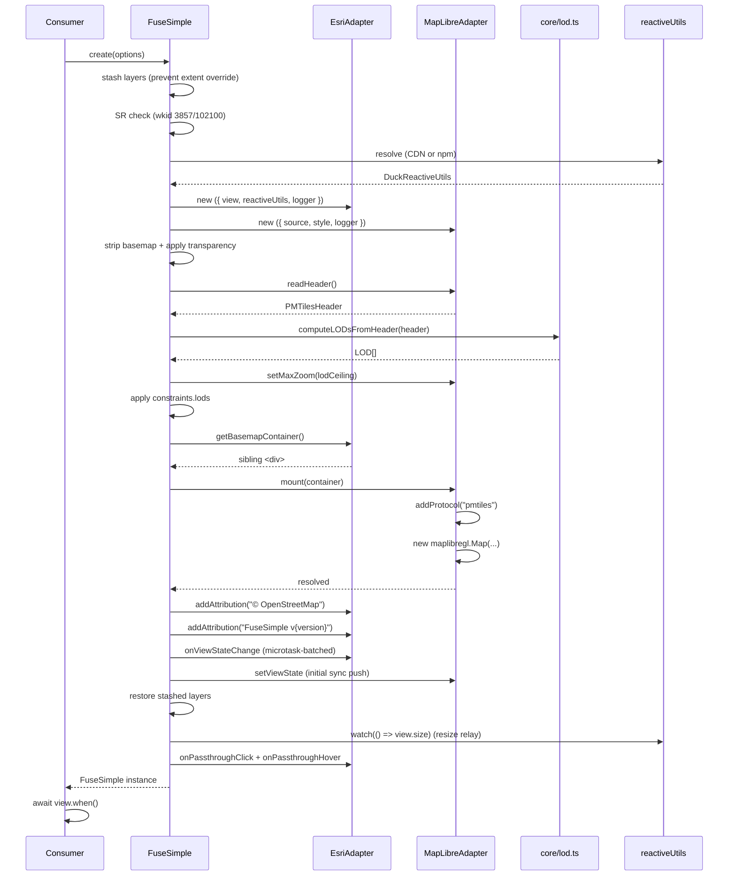

# Basemap Lifecycle Flow

> **Status:** current as of 0.13.0. Covers both the npm (bundler) and
> standalone (CDN) paths. All TBDs from prior versions have been
> resolved and implemented.

## Purpose

Bringing up and tearing down the hidden MapLibre + PMTiles basemap that lives
behind a transparent Esri MapView. The operational adapter owns the DOM
container and lifecycle timing; the basemap adapter owns the engine. This
flow is what gets a user from "I called `FuseSimple.create()`" to "tiles are
on screen" — and, in reverse, from "I called `destroy()`" to "everything is
garbage-collectable."

If a bug involves tiles never appearing, tiles appearing in the wrong place
on first paint, a container with the wrong size, or a zombie map after
teardown, this is the doc to start with.

## Entry Points

- `src/core/FuseSimple.ts` — `FuseSimple.create(options)` — user-facing
  factory. Must be called **before** `await view.when()` per
  `docs/FuseSimple_v1_Decisions.md` §3.
- `src/adapters/esri.ts` — `EsriOperationalAdapter` — wraps the Esri
  MapView. Receives `reactiveUtils` at construction (resolved dynamically
  by `FuseSimple.create()`). Owns the sibling `
`, view-state
  subscription via `reactiveUtils.watch()`, click/hover passthrough via
  `hitTest`, and OSM attribution injection.
- `src/adapters/maplibre.ts` — `MapLibreBasemapAdapter.mount(container)` —
  registers the PMTiles protocol (once, module-level), builds a `PMTiles`
  archive, resolves the style, and constructs the `maplibregl.Map`.
- `src/adapters/maplibre.ts` — `MapLibreBasemapAdapter.readHeader()` — async
  read of PMTiles header for LOD + initial-extent math. Cached after first
  call.
- `src/core/lod.ts` — `computeLODsFromHeader(header)` — pure Web Mercator
  level/resolution/scale math. Unit-tested.
- `src/core/style-resolver.ts` — `deriveBasemapHost()` +
  `resolveStylePlaceholders()` — pure helpers the adapter calls to resolve
  `{basemapHost}` sprite / glyph placeholders before handing the style to
  MapLibre. Unit-tested.
- `src/adapters/maplibre.ts` — `MapLibreBasemapAdapter.destroy()` — teardown
  symmetric to `mount`. Drops the `Map`, the `PMTiles` archive, and the
  container reference. Deliberately does **not** `removeProtocol` — the
  `pmtiles` handler is process-global and may still be serving other
  adapters.
- `src/core/FuseSimple.ts` — `FuseSimple#destroy()` — user-facing teardown.
  Unsubscribes sync + passthrough in reverse registration order, destroys
  the basemap adapter, clears event listeners. Idempotent.

## Sequence

High-level ordering. The steps marked _(pure)_ run without touching the DOM
or either engine and are safe to unit-test; the rest need the real MapView
and a real PMTiles archive.

0. **Layer stashing** — temporarily remove all layers from `view.map.layers`
   before the view initializes. Esri's MapView auto-fits to layer extents
   during initialization: layers with large extents zoom out to fit, while
   layers with no extent (empty `GraphicsLayer`, `StreamLayer` before data
   arrives) default to world extent (zoom 0). Either way the consumer's
   `center`/`zoom` gets overridden. Stashing prevents this entirely. The
   layers are restored in step 12a after the initial sync push, so
   widgets like `Home` capture the correct "home" viewpoint. _(Added in
   0.12.0; see `docs/initial-extent-investigation.md` for the full root
   cause analysis.)_
1. **`FuseSimple.create(options)`** — validate spatial reference is Web
   Mercator (`wkid === 3857 || 102100`); throw with a clear message if not.
   _(Decisions §6.)_
1b. **Resolve `reactiveUtils`** — dynamically import
   `@arcgis/core/core/reactiveUtils` without a static dependency on
   `@arcgis/core`. Two resolution paths:
   - **CDN path:** `$arcgis.import("esri/core/reactiveUtils")` — the global
     registered by Esri's `<script type="module" src="https://js.arcgis.com/5.0/">`.
   - **npm path:** `import("@arcgis/core/core/reactiveUtils.js")` — dynamic
     import resolved against the consumer's `node_modules`.
   The resolved module is passed to `EsriOperationalAdapter` at construction
   so the adapter never imports `@arcgis/core` statically.
2. **Instantiate adapters** — `new EsriOperationalAdapter({ view, reactiveUtils, logger })` and
   `new MapLibreBasemapAdapter({ source, style, logger })`. No DOM work yet.
3. **Existing-basemap check** — if `view.map.basemap` is non-null, log a
   warning under `LIFECYCLE` and strip it. _(Decisions §7.)_
4. **Transparency application** — set `view.background = { color: [0,0,0,0] }`
   and, if needed, a CSS fallback on existing canvases. _(Decisions §2.)_
5. **PMTiles header read** — `MapLibreBasemapAdapter.readHeader()` resolves
   the archive's `bounds` / `center` / `minZoom` / `maxZoom`. Log under
   `HEADER`.
6. **LOD computation** _(pure)_ — `computeLODsFromHeader(header)` produces
   the `view.constraints.lods` array. Throws on degenerate ranges (inverted,
   below zoom-1 floor).
7. **Apply LODs + initial extent** — assign to `view.constraints.lods`;
   disable `snapToZoom` for fractional zoom support; compare the consumer's
   initial view to `header.bounds` and warn under `HEADER` if it falls
   outside. _(Decisions §8.)_ The LOD ceiling is also passed to the
   MapLibre adapter via `setMaxZoom()` so both engines share the same zoom
   range (MapLibre defaults to 22, but LODs may extend to 24 for vector
   tile overzoom).
8. **Allocate sibling `
`** — `EsriOperationalAdapter.getBasemapContainer()`
   creates the behind-Esri container with `position: absolute; inset: 0;
   z-index: 0; pointer-events: none;`. _(Decisions §1.)_
9. **Mount basemap** — `basemapAdapter.mount(container)`. Inside mount:
   PMTiles protocol registration (`maplibregl.addProtocol("pmtiles",
   protocol.tile)` — must happen before the `Map` constructor per
   Decisions §"PMTiles protocol registration — ordering"), style resolution,
   `new maplibregl.Map(...)` with `interactive: false`, `trackResize: false`,
   `attributionControl: false`. _(Decisions §5.)_
10. **Attribution injection** — `EsriOperationalAdapter.addAttribution()`
    injects pinned `` elements into the Esri Attribution widget
    next to "Powered by Esri" (`__powered-by`). Called twice: once for
    OSM credit, once for `FuseSimple v{version}`. The spans use
    `flex-shrink: 0` so they stay visible while the layer sources text
    truncates on the left. A `MutationObserver` per call re-injects if
    the widget re-renders; observers are stored and disconnected on
    `destroy()`. _(Decisions §4; pinned layout added in 0.12.1.)_
11. **Sync loop start** — subscribe to view state changes via
    `reactiveUtils.watch()` with `{ sync: true }` (fires the callback
    synchronously in the same frame as the Esri property change). Three
    watchers track `view.center`, `view.zoom`, and `view.rotation`
    independently. **Microtask batching** (added in 0.11.2): a dirty flag
    + `queueMicrotask()` coalesces 2-3 synchronous watcher fires into a
    single `handler()` call per frame. The microtask runs after the
    synchronous burst but before the browser paints — zero frame delay.
    Rotation is sign-flipped to MapLibre bearing (`bearing = -rotation`).
    Zoom is corrected from `view.resolution` to account for the linear vs
    exponential interpolation mismatch between Esri and MapLibre at
    fractional zoom levels — see `docs/drift-investigation.md` for the
    full analysis.
12. **Initial sync push** — the watch callbacks only fire on *changes*. A
    one-time push of the current Esri view state ensures MapLibre starts at
    the right center/zoom/bearing instead of its default world view.
12a. **Layer restore** — the layers stashed in step 0 are added back to
    `view.map.layers` via `addMany()`. By this point the view's center,
    zoom, and Home widget viewpoint are all locked in, so layer extent
    calculations can no longer override them. Logged under `LIFECYCLE`.
13. **Resize relay** — `reactiveUtils.watch(() => view.size, ...)` relays
    Esri container size changes to `basemapAdapter.resize()`. MapLibre is
    constructed with `trackResize: false`, so without this explicit relay
    the basemap canvas would remain stuck at its initial dimensions.
14. **Passthrough events** — `onPassthroughClick` and `onPassthroughHover`
    subscribe to Esri `click` and `pointer-move` events. Each runs a
    `hitTest` — if zero Esri features are hit, the event is forwarded to
    `basemapAdapter.queryFeaturesAt()` and emitted as `basemap-click` or
    `basemap-hover`. Hover is rAF-throttled.
15. **First paint** — consumer awaits `view.when()` per the documented
    "call before `when()`" contract.

## State Transitions

- `view.map.layers` — removed in step 0 (stashed to a local array),
  restored in step 12a via `addMany()`. Between steps 0 and 12a the map
  has no layers, which prevents Esri from auto-fitting to layer extents.
- `view.background` — written once in step 4, never again.
- `view.map.basemap` — potentially written (to `null`) in step 3.
- `view.constraints.lods` — written once in step 7. `snapToZoom` set to
  `false` in the same step. Decisions §3 open risk: if a future
  `@arcgis/core` version locks this earlier we revisit.
- `view.ui` (Attribution widget) — text node written in step 10 (twice:
  OSM credit and FuseSimple version). A `MutationObserver` per injection
  handles re-application on widget re-render; observers are stored on
  `EsriOperationalAdapter` and disconnected in `destroy()` _(Decisions §4)_.
- `maplibregl` global — `addProtocol("pmtiles", …)` happens exactly once
  per process from a module-level `sharedProtocol` singleton in
  `src/adapters/maplibre.ts`. Subsequent adapter instances (hypothetical
  in v1) share that handler by calling `sharedProtocol.add(pmtiles)` with
  their own archive. `destroy()` does **not** call `removeProtocol` —
  doing so would break any other live adapter still using it, and the
  cost of leaving the handler registered is one closure.
- Sibling `
` — created in step 8, removed on destroy by
  `EsriOperationalAdapter.destroy()`. Its size is driven by
  `reactiveUtils.watch(() => view.size)` (step 13).
- MapLibre `Map` instance — constructed in step 9, `remove()`d on destroy.
- `basemapAdapter.setLayerVisibility()` — runtime state change via
  `FuseSimple.setBasemapLayerVisibility()`. Maps to
  `map.setLayoutProperty(id, 'visibility', 'visible'|'none')`. No-ops
  silently if the layer doesn't exist.

## Failure Modes

- **Throws** in step 1 if the MapView isn't Web Mercator. Error text per
  Decisions §6 points the consumer at the fix.
- **Throws** in step 1b if `reactiveUtils` can't be resolved via either
  path (CDN `$arcgis.import` or npm dynamic `import()`). This means
  `@arcgis/core` wasn't loaded before `FuseSimple.create()`.
- **Throws** from `computeLODsFromHeader` in step 6 on inverted / negative /
  non-finite / below-zoom-1-floor ranges. See
  `src/core/lod.test.ts` for the exact message shapes.
- **Layer stashing** in step 0 is safe for all layer types tested:
  `FeatureLayer`, `GraphicsLayer`, `StreamLayer`, and combinations.
  If `create()` throws between steps 0 and 12a, the layers remain
  removed. This is acceptable because a throw in `create()` is fatal
  anyway (the consumer hasn't received a FuseSimple instance). If this
  becomes a concern, a `try/catch` restore could be added around the
  intervening steps.
- **Warns via logger** (`LIFECYCLE`) in step 3 if the consumer's Map
  already had a basemap. Non-fatal — we strip and proceed.
- **Warns via logger** (`HEADER`) in step 7 if the consumer's initial
  center falls outside `header.bounds`. Non-fatal — MapLibre will simply
  render empty tiles there, and the log tells the debugger why.
- **Silently degrades** (sprite): if the basemap style has a relative or
  invalid sprite URL, MapLibre logs "Invalid sprite URL" but renders
  without icons. Non-blocking. Documented as a known issue in TODO.md.
- **Destroy during mount** — `destroy()` may be called while step 5 / 9
  are still in flight. The MapLibre adapter handles this via an
  `isDestroyed` flag checked at each `await` point in `mount()`:
  - If `destroy()` fires before the `Map` is constructed, `mount()` bails
    without creating one.
  - If it fires between `new maplibregl.Map(...)` and the `"load"` event,
    `destroy()` calls `map.remove()` immediately and the `mount()`
    Promise resolves as a no-op once `"load"` eventually arrives (or
    doesn't). Callers never see an unhandled rejection.
  The `AbortSignal` alternative was considered and deferred — the flag
  approach is simpler, and the `readHeader()` fetch is fast enough in
  practice that an abort path hasn't paid for itself yet.

## Debug Tags

| Tag | Covers | When it fires |
|---|---|---|
| `LIFECYCLE` | steps 0, 1, 1b, 3, 4, 8, 9, 12a, 13 and destroy | Once per phase on entry; again on teardown |
| `HEADER` | steps 5, 6, 7 | After header read and LOD computation; on bounds mismatch |
| `STYLE` | step 9 | On style resolution (bundled vs URL vs inline) and apply |
| `SYNC` | steps 11, 12 | On each view state change + initial push; includes zoom correction |
| `ATTRIBUTION` | step 10 | On injection and on re-inject via MutationObserver |
| `PASSTHROUGH` | step 14 | On each passthrough click or hover |
| `EVENTS` | step 14 | On `basemap-click` / `basemap-hover` emission to user listeners |

Suggested activation during a bring-up bug: `?debug=LIFECYCLE,HEADER,STYLE`.
Add `SYNC` only after first paint is solid — it fires once per frame during
movement and will drown out setup logs.

## Standalone (CDN) vs npm Path

The lifecycle sequence above applies to both distribution paths. The
differences are in how `reactiveUtils` is resolved (step 1b) and how the
consumer bootstraps:

| | npm (bundler) | Standalone (CDN) |
|---|---|---|
| **Import** | `import { FuseSimple } from "@mapsimple/fusesimple"` | `import { FuseSimple } from "./fusesimple.min.js"` |
| **MapLibre/PMTiles** | Consumer's `node_modules` (peer-ish via FuseSimple's deps) | Baked into the standalone bundle |
| **`@arcgis/core`** | Consumer's `node_modules` (peer dep) | Esri CDN `<script type="module" src="https://js.arcgis.com/5.0/">` |
| **`reactiveUtils` resolution** | `import("@arcgis/core/core/reactiveUtils.js")` | `$arcgis.import("esri/core/reactiveUtils")` |
| **View readiness** | `await view.when()` after `FuseSimple.create()` | `mapEl.addEventListener("arcgisViewReadyChange", ...)` |

See `docs/standalone-guide.md` for the full standalone setup walkthrough.

## Prior Art References

- Decision #1: DOM strategy (dual-canvas stack) —
  `docs/FuseSimple_v1_Decisions.md#1-dom-strategy--dual-canvas-stack`
- Decision #2: Esri canvas transparency —
  `docs/FuseSimple_v1_Decisions.md#2-esri-canvas-transparency`
- Decision #3: PMTiles header → Esri tiling scheme timing —
  `docs/FuseSimple_v1_Decisions.md#3-pmtiles-header--esri-tiling-scheme--timing`
- Decision #5: bundled default style with sprite/glyph placeholders —
  `docs/FuseSimple_v1_Decisions.md#5-bundled-default-style--sprites-and-glyphs`
- Decision #6: spatial reference constraint —
  `docs/FuseSimple_v1_Decisions.md#6-spatial-reference-constraint`
- Decision #7: consumer's Map already has a basemap —
  `docs/FuseSimple_v1_Decisions.md#7-consumers-map-already-has-a-basemap`
- Decision #8: initial extent consumer vs header —
  `docs/FuseSimple_v1_Decisions.md#8-initial-extent--consumer-vs-pmtiles-header`
- Prior art: `maplibre-gl-leaflet` — primary reference for the dual-engine
  mount pattern. See
  `docs/FuseSimple_v1_Prior_Art_Reference.md#1-maplibre-gl-leaflet-primary-reference`

## Open Questions

- ~~Q: Should `mount` accept an `AbortSignal` so `destroy()` during a slow
  PMTiles fetch can cancel the header read cleanly, or is the
  `isDestroyed` flag approach simpler?~~ **Resolved (0.6.0).** Picked the
  `isDestroyed` flag approach; see "Destroy during mount" above.
- Q: Does `view.constraints.lods` need to be re-applied on subsequent
  `view.when()` promises, or is a single assignment durable? Empirical
  test required against `@arcgis/core` 5.0.
- ~~Q: When the bundled Protomaps Light style's sprite / glyph placeholders
  can't be resolved, does MapLibre throw or render text-free?~~
  **Resolved (0.11.0).** MapLibre logs "Invalid sprite URL" but renders
  without icons. Non-blocking silent degradation. The bundled stub's
  relative `/sprite` path is a known issue tracked in TODO.md.
