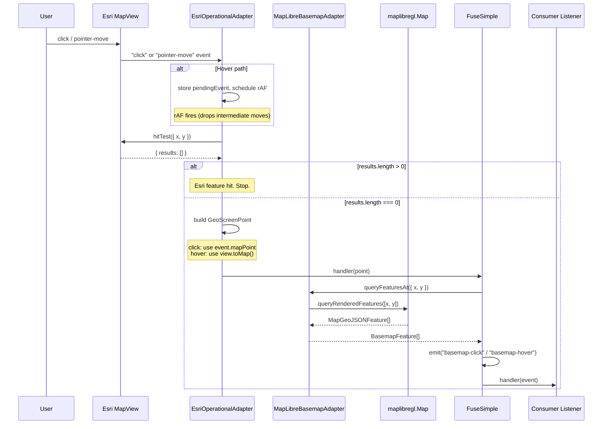

# Click & Hover Passthrough Flow

> **Status:** current as of 0.13.0.

## Purpose

Esri owns all user input. The MapLibre basemap sits behind the Esri MapView
with `pointer-events: none`, so it never receives clicks or mouse moves
directly. Passthrough solves the gap: when a click or hover lands on the Esri
canvas but misses every Esri feature, FuseSimple queries MapLibre's rendered
features at the same screen pixel and surfaces the result as a `basemap-click`
or `basemap-hover` event. This gives consumers a single event API for
interacting with basemap vector features (roads, buildings, parcels) without
ever touching MapLibre themselves.

If a bug involves basemap features not responding to clicks, hover events
firing too frequently (or not at all), or coordinate mismatches between the
click location and the returned features, start here.

## Entry Points

- `src/adapters/esri.ts` -- `EsriOperationalAdapter.onPassthroughClick(handler)` --
  subscribes to Esri `view.on("click", ...)`. Runs `hitTest`; if zero Esri
  features hit, fires `handler` with screen + geographic coordinates.
- `src/adapters/esri.ts` -- `EsriOperationalAdapter.onPassthroughHover(handler)` --
  subscribes to Esri `view.on("pointer-move", ...)`. rAF-throttled. Same
  hitTest logic as click but with `view.toMap()` for coordinate conversion
  (pointer-move events lack `mapPoint`).
- `src/adapters/maplibre.ts` -- `MapLibreBasemapAdapter.queryFeaturesAt(point)` --
  calls `map.queryRenderedFeatures([x, y])` and normalizes results into
  `BasemapFeature[]`.
- `src/core/FuseSimple.ts` -- Step 8 in `create()` -- wires the two adapters
  together: passthrough handler calls `queryFeaturesAt`, wraps the result in a
  `BasemapClickEvent` or `BasemapHoverEvent`, and calls `emit()`.
- `src/core/FuseSimple.ts` -- `FuseSimple.emit(event, data)` -- dispatches to
  all `on()` listeners with error isolation per handler.

## Sequence

### Click passthrough

1. User clicks the map. The Esri MapView captures the DOM event and fires its
   internal `"click"` handler.
2. `EsriOperationalAdapter.onPassthroughClick` receives the raw click event
   (`src/adapters/esri.ts`, line 242). The event carries `x`, `y` (screen
   pixels) and `mapPoint` (geographic coordinates from Esri's projection).
3. The adapter calls `view.hitTest({ x, y })` to check whether any Esri
   operational features exist at that pixel.
4. `hitTest` resolves. If `response.results.length > 0`, the click hit an
   Esri feature and passthrough is skipped (the consumer handles it through
   Esri's own event system).
5. If zero Esri features hit, the adapter builds a `GeoScreenPoint` from the
   event's `x`, `y`, `mapPoint.longitude`, and `mapPoint.latitude`, logs it
   under `PASSTHROUGH`, and calls the `handler` callback.
6. Back in `FuseSimple.create()` (step 8), the handler calls
   `basemapAdapter.queryFeaturesAt({ x, y })`.
7. Inside `MapLibreBasemapAdapter.queryFeaturesAt()` (`src/adapters/maplibre.ts`,
   line 336), MapLibre's `map.queryRenderedFeatures([x, y])` runs at that
   exact pixel coordinate. Results are normalized into `BasemapFeature[]`:
   each hit gets a `layer` (source-layer name or stylesheet layer ID),
   `properties` (shallow copy), and optional `geometryType`.
8. The handler wraps the features and coordinates into a `BasemapClickEvent`
   (`{ features, lngLat }`), logs the feature count under `EVENTS`, and calls
   `instance.emit("basemap-click", event)`.
9. `emit()` iterates a snapshot of `this.listeners["basemap-click"]` (snapshot
   prevents issues if a handler calls `off()` mid-iteration). Each handler is
   called inside a `try/catch`; thrown errors are logged under `BUG` tag with
   `bugId: "BUG-001"` and do not prevent subsequent handlers from firing.

### Hover passthrough

1. User moves the mouse over the map. Esri fires `"pointer-move"` on every
   pixel of movement.
2. `EsriOperationalAdapter.onPassthroughHover` (`src/adapters/esri.ts`,
   line 292) stores the latest event in `pendingEvent` and schedules a
   `requestAnimationFrame` callback if one isn't already pending.
3. On the next animation frame, `flush()` runs. It reads the latest
   `pendingEvent` (all intermediate moves are dropped), clears it, and calls
   `view.hitTest({ x, y })`.
4. If `hitTest` returns zero Esri results, the adapter converts screen
   coordinates to geographic via `view.toMap({ x, y })` (pointer-move events
   don't carry `mapPoint` like click events do). If `toMap` returns null
   (edge of the view, view destroyed), the event is silently dropped.
5. The adapter builds a `GeoScreenPoint`, logs under `PASSTHROUGH`, and calls
   `handler`.
6. Steps 6-9 mirror the click path, except the event name is `basemap-hover`
   and no `EVENTS` log is emitted (hover is high-frequency; only `PASSTHROUGH`
   fires).

## Hover Throttling

Hover uses `requestAnimationFrame` to throttle `hitTest` calls to at most one
per animation frame (~16ms at 60fps). The mechanism:

- Every `"pointer-move"` event overwrites `pendingEvent` with the latest
  mouse position.
- If no rAF is already scheduled (`rafId === null`), a new one is requested.
- When the rAF fires, `flush()` reads the latest `pendingEvent`, nulls it out,
  and runs `hitTest` on that single position. All intermediate pointer moves
  since the last frame are discarded.
- `rafId` is reset to `null` at the top of `flush()`, so the next
  `pointer-move` after the flush will schedule a new frame.

This prevents flooding the GPU with `hitTest` work during fast mouse movement.
No debounce or additional delay is applied beyond the rAF gate.

On teardown, the unsubscribe function cancels any pending rAF via
`cancelAnimationFrame(rafId)` and nulls `pendingEvent` to prevent a stale
flush from firing after cleanup.

## Coordinate Translation

Esri and MapLibre share the same container dimensions and the same projection
(Web Mercator, 256px tiles). Both canvases are stacked in the same parent div
with identical CSS dimensions. The sync loop keeps them pixel-locked at the
same center/zoom/bearing. This means screen pixel `(x, y)` in Esri's
coordinate space maps to the same `(x, y)` in MapLibre's coordinate space
with no translation or scaling needed.

The geographic coordinates come from two sources depending on event type:

- **Click:** Esri's click event includes `mapPoint` (longitude/latitude),
  so geographic coords are read directly from the event.
- **Hover:** Esri's `pointer-move` event does not include `mapPoint`.
  The adapter calls `view.toMap({ x, y })` to convert screen pixels to
  geographic coordinates. `toMap` can return `null` if the point falls
  outside the view's renderable area.

In both cases the `GeoScreenPoint` handed to the FuseSimple handler carries
both screen (`x`, `y`) and geographic (`lng`, `lat`) coordinates so
consumers can position DOM elements (popups, tooltips) in screen space and
fetch additional data in geographic space without re-projecting.

## Debug Tags

| Tag | Covers | When it fires |
|---|---|---|
| `PASSTHROUGH` | hitTest result processing, coordinate conversion | Once per passthrough click; once per rAF-throttled hover that passes hitTest |
| `EVENTS` | `basemap-click` emission with feature count and lngLat | Once per click passthrough (not logged for hover to reduce noise) |
| `LIFECYCLE` | Listener start/stop for both click and hover handlers | On `create()` setup and `destroy()` teardown |
| `BUG` | Uncaught errors in consumer `on()` handlers (bugId: BUG-001) | When a listener throws during `emit()` |

Suggested activation for passthrough debugging: `?debug=PASSTHROUGH,EVENTS`

Add `LIFECYCLE` if you need to verify listeners are being registered and torn
down correctly. Avoid `?debug=all` during hover testing -- `SYNC` fires once
per frame during any mouse movement and will bury passthrough output.

## Failure Modes

- **MapLibre not mounted yet** -- `queryFeaturesAt` checks `if (!this.map)
  return []`. If passthrough fires before mount completes (unlikely given
  create() awaits mount), the consumer gets an empty feature array. No throw,
  no warning.
- **`queryRenderedFeatures` returns empty** -- normal behavior when the click
  lands on an area with no basemap vector features (e.g. water, empty space).
  The consumer receives a `BasemapClickEvent` / `BasemapHoverEvent` with
  `features: []`. This is not an error.
- **`hitTest` rejects** -- can happen if the Esri view is destroyed mid-click
  or mid-hover (e.g. consumer calls `destroy()` during a click). The `.catch`
  block silently swallows the rejection. No event is emitted, no error is
  logged. This is intentional: there's nobody left to receive the event.
- **`view.toMap()` returns null** -- hover path only. Happens when the pointer
  is at the extreme edge of the view or the view is mid-destruction. The hover
  handler returns early without calling the callback. No event emitted.
- **Consumer listener throws** -- `emit()` wraps each handler call in
  `try/catch`. The error is logged under `BUG` tag (`bugId: "BUG-001"`,
  `category: "EVENTS"`) and iteration continues to the next listener. One
  misbehaving listener cannot block others.
- **Listener calls `off()` during `emit()`** -- `emit()` iterates a spread
  copy of the listener array (`[...this.listeners[event]]`), so removing a
  handler mid-iteration doesn't skip entries or cause index errors.
- **Destroy during active passthrough** -- `destroy()` calls teardown
  functions in reverse registration order. The click and hover unsubscribe
  functions call `handle.remove()` on the Esri event handles and (for hover)
  `cancelAnimationFrame(rafId)`. Any in-flight `hitTest` Promise will resolve
  into the `.catch` handler since the view is being destroyed.

## Prior Art References

- Spec: passthrough detection via `hitTest` --
  `docs/FuseSimple_v1_Spec.md` SS3.4 (Click/Hover Passthrough)
- Prior art: `maplibre-gl-leaflet` interaction forwarding --
  `docs/FuseSimple_v1_Prior_Art_Reference.md#1-maplibre-gl-leaflet-primary-reference`
- Decision #1: DOM strategy (dual-canvas stack, `pointer-events: none`) --
  `docs/FuseSimple_v1_Decisions.md#1-dom-strategy--dual-canvas-stack`
