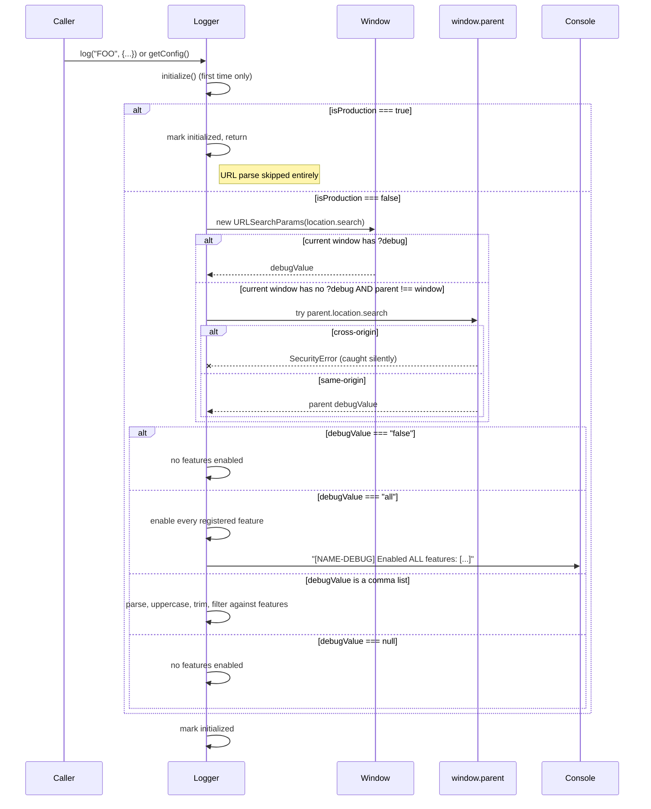

# DebugLogger Flow

> **Status:** current as of 0.13.0. The `log()` signature was tightened
> from `data: any` to `data: Record<string, unknown>` in 0.11.1.

## Purpose

`DebugLogger` is the only way FuseSimple (and its consumer apps) emit
structured runtime output. It is URL-activated, feature-scoped, zero-overhead
when off, and hard-lockdownable for production. The design goal is: **ship
diagnostic instrumentation in every build, and toggle it without a redeploy.**

If you are chasing a bug in FuseSimple, the first thing to do is light up the
relevant tag with `?debug=<TAG>` in the URL, reproduce the bug, and read the
logs. If you are chasing a bug in the logger itself, this document is the map.

## Entry Points

- `src/debug-logger.ts` — `new DebugLogger(options)` — construction, either
  directly by a consumer or indirectly via `createDebugLogger({...})`.
- `src/debug-logger.ts` — `createDebugLogger(options)` — factory helper, does
  nothing except `new DebugLogger(options)`.
- `src/debug-logger.ts` — `logger.log(feature, data)` — the one call that
  routes output. `feature` is a `DebugFeature` (string), `data` is
  `Record<string, unknown>` (tightened from `any` in 0.11.1 for type
  safety). Everything else (`isEnabled`, `initialize`) is internal and
  triggered lazily from here.
- `src/debug-logger.ts` — `logger.getConfig()` — diagnostic surface; also
  triggers `initialize()` lazily on first call.

Consumers never touch `DebugLogger` directly for FuseSimple's internal logging
— that instance is owned by `FuseSimple.create()` and configured with the
internal tag list plus the `isProduction` flag plumbed through from
`FuseSimpleOptions`. Consumers construct their **own** logger instance if they
want to participate in the same `?debug=` URL flag, registering their own tags.

## Sequence

### Construction (synchronous, no side effects)

1. Caller builds a `DebugLoggerOptions` object with `name`, `features`, and
   optional `isProduction`.
2. `new DebugLogger(options)` stores `name`, `features`, and `isProduction`
   (defaulting to `false`) on private fields. It does **not** read the URL,
   does **not** touch `window`, does **not** log anything. Initialization is
   deferred until the first `log()` or `getConfig()` call.

### First call (`log()` or `getConfig()`) — lazy initialization

### Subsequent calls (`log(feature, data)`)

1. If `isProduction === true`, return immediately. No logging, ever.
2. If `feature === "BUG"`, build the BUG payload (with `UNKNOWN`/`GENERAL`
   defaults for missing fields), call `console.warn`, return.
3. Otherwise call `isEnabled(feature)`:
   - If `isProduction`, returns `false` (including for `BUG` — but that's
     caught in step 1 already, so the check is defense-in-depth).
   - Otherwise calls `initialize()` (no-op after first call) and returns
     `enabledFeatures.has(feature)`.
4. If not enabled, return. If enabled, build the log payload and call
   `console.log`.

## State Transitions

All state is **per-instance**. There is no module-level state, no static
registry, no cross-instance communication. Each `DebugLogger` holds:

| Field | Written | Read | Notes |
|---|---|---|---|
| `name` | Constructor | Every `log()` call (prefix) | Never mutates |
| `features` | Constructor | `initialize()`, `isEnabled()` | Never mutates |
| `isProduction` | Constructor | `initialize()`, `isEnabled()`, `log()`, `getConfig()` | Never mutates |
| `enabledFeatures` | `initialize()` (once) | `isEnabled()`, `getConfig()` | Populated once, never cleared |
| `initialized` | `initialize()` (once) | `initialize()` guard | One-way `false → true` |

Because each instance is independent, two loggers with overlapping feature
names never cross-pollute. A consumer's `DebugLogger('MYAPP', ['LIFECYCLE'])`
and FuseSimple's internal `DebugLogger('FUSESIMPLE', ['LIFECYCLE'])` would
both respond to `?debug=LIFECYCLE`, but each would produce output under its
own prefix. That's a feature, not a collision.

## Failure Modes

- **Cross-origin parent access throws `SecurityError`** — caught and swallowed
  inside `initialize()`. The fallback path simply ends without enabling any
  parent-requested tags. The logger remains usable for the current window's
  own `?debug=` value (if any) and for `BUG`-level output.
- **Missing `bugId` or `category` on a `BUG` payload** — filled in with
  `"UNKNOWN"` and `"GENERAL"` defaults. The log still emits.
- **Tag not registered in `features`** — the tag is silently dropped during
  URL parsing. `isEnabled()` returns `false` for it. No warning. This is how
  multi-instance isolation works: each logger only reacts to tags it knows.
- **`isProduction: true`** — everything short-circuits. No URL parse, no log
  output, no `BUG` surfacing. The logger becomes an inert object. This is
  intentional — it's the entire point of the flag.
- **`window.parent === window` (no iframe)** — the parent fallback path is
  skipped. Normal behavior; not an error.

There are no thrown errors from any public method except what the caller
itself passes in. `log()` is infallible.

## Debug Tags

Not applicable — the DebugLogger does not instrument itself. Meta-logging
would be a loop. If you need to debug the logger, use test coverage in
`src/debug-logger.test.ts` or add temporary `console.log` calls in a local
checkout (not committed).

## Prior Art References

- Origin: MapSimple ExB `debug-logger.ts`, see
  `../FuseSimple_v1_Spec.md` note on reuse and CLAUDE.md "Logging" section.
- Port rationale and rename decisions: `../FuseSimple_v1_Decisions.md`
  (Decision log and Logging section in CLAUDE.md — the `widgetName → name`
  rename, options-object factory, and `isProduction` hard-lockdown semantics
  were FuseSimple additions on top of the ExB original).

## Open Questions

- **Per-instance URL scoping** — v1 shares the single `?debug=` URL param
  across every `DebugLogger` instance, filtered by each instance's
  `features`. If we ever see real-world tag-name collisions that cause noise,
  we can add a namespaced form like `?debug=FUSE:SYNC,MYAPP:FETCH`. Not
  planned for v1. Decision recorded in the conversation that produced this
  doc.
